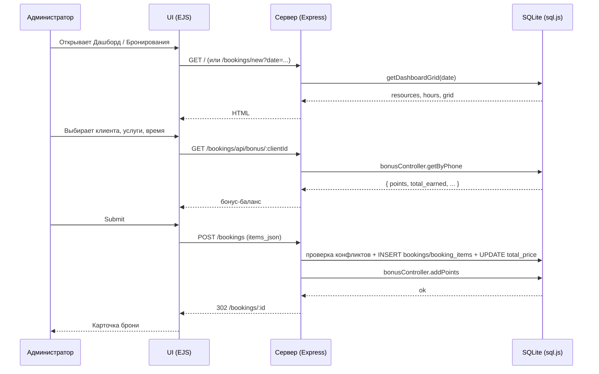

# DESIGN — Белка Парк CRM (UX/UI спецификация)

> Документ описывает потоки пользователя, состояния экранов, копирайтинг и edge-cases.
> Технические детали — в [REPORT.md](REPORT.md).

## 1. Роли и доступ

| Роль (БД) | В UI | Навигация / смысл |
| --- | --- | --- |
| `owner` | Владелец | Полный доступ ко всем разделам; финансовые KPI на дашборде; обход матрицы для маршрутов (`requirePermission`). |
| `admin` | Администратор парка | Главная, клиенты, брони, услуги, допы, учёт времени, аналитика, мой кабинет; **без** пользователей, журнала, настроек, матрицы доступов, модуля ЗП/финансов. |
| `instructor` | Инструктор (верёвочный курс) | Главная (сетка **только квесты**), брони **только просмотр**, мой кабинет. |
| `cleaner` | Уборка | Главная (полная сетка по зонам), брони **только просмотр**, мой кабинет. |

Роль **`manager`** снята: при миграции записи переводятся в **`admin`**.

Сайдбар и гейты — по **`requirePermission`** и матрице `role_permissions` ([config/permissions.js](../config/permissions.js)); **`requireRole('admin', 'owner')`** для `POST /admin/demo-preview`. Демо-предпросмотр: роли `admin`, `instructor`, `cleaner` в [utils/demoPreview.js](../utils/demoPreview.js).

Дополнительно:

- Устаревшие роли `operator`, `lasertag_instructor`, `quests_animator` приводятся к **`admin`**.
- На главной у **инструктора** сетка фильтруется по `quests`; у **админа парка** и **владельца** — все колонки.
- При открытии `/bookings/:id` доступ проверяется по категориям позиций (`booking.items[].item_category/service_category`).

## 2. Карта экранов

> Простое описание каждой страницы «по-человечески» с матрицей доступа ролей и пустыми пунктами «Что менять» — в [PAGES.md](PAGES.md). Этот раздел остаётся технической картой URL→шаблон.

```
/login                       auth/login.ejs
/                            dashboard.ejs
/clients                     clients/list.ejs            [admin]
/clients/search              JSON                         [admin]
/clients/new                 clients/form.ejs             [по праву clients:*]
/clients/:id                 clients/detail.ejs           [по праву clients:*]
/clients/:id/edit            clients/form.ejs             [admin]
/services                    services/list.ejs           [admin]
/services/new                services/form.ejs           [admin]
/services/:id/edit           services/form.ejs           [admin]
/extras                      extras/list.ejs             [admin]
/bookings                    bookings/list.ejs
/bookings/new                bookings/form.ejs
/bookings/:id                bookings/detail.ejs
/bookings/:id/edit           bookings/form.ejs
/admin/finance               admin/finance/dashboard.ejs    [admin]
/admin/finance/payments      admin/finance/payments.ejs     [admin]
/admin/finance/payments/:id  admin/finance/payment-detail.ejs [admin]
/admin/finance/expenses      admin/finance/expenses.ejs     [admin]
/admin/finance/shifts        admin/finance/shifts.ejs       [admin]
/admin/finance/payouts       admin/finance/payouts.ejs      [admin]
GET  /quick/users            JSON                           [bookings:mutate]
POST /quick/expenses         JSON (модалка «Расход»)        [bookings:mutate]
POST /quick/shifts           JSON (модалка «Смена»)         [bookings:mutate]
GET  /quick/today            JSON (блок «Мои записи»)       [bookings:mutate]
DELETE /quick/expenses/:id   JSON                           [owner любой; иначе свой ≤1ч]
DELETE /quick/shifts/:id     JSON                           [owner любой; иначе свой ≤1ч]
/admin/reports               admin/reports.ejs           [admin:reports]
/admin/users                 admin/users.ejs             [admin:users — обычно owner]
/admin/users/new             admin/user-form.ejs         [admin:users]
/admin/users/:id/edit        admin/user-form.ejs         [admin:users]
/admin/logs                  admin/logs.ejs              [admin:logs — обычно owner]
/admin/settings              admin/settings.ejs          [admin:settings — обычно owner]
POST /admin/demo-preview     (редирект назад)            [admin, только при demo_mode_enabled]
404                          error.ejs
```

Партиалы: [views/partials/header.ejs](../views/partials/header.ejs) (сайдбар + топбар + поиск + кнопка «Выйти»), [views/partials/footer.ejs](../views/partials/footer.ejs) (в т.ч. [views/partials/demo-role-panel.ejs](../views/partials/demo-role-panel.ejs) при активном демо-режиме для руководителя CRM).

## 3. Глобальный layout

- Визуальная основа — **Figma Make** ([макет](https://www.figma.com/make/tQRHB6UYYO6YfSRu7MWoS8/Create-based-on-prompt)): тёмно-зелёный сайдбар `#1b4332`, активный пункт `#40916c`, светлый фон контента `#f9fafb`, топбар 64px.
- Левая колонка — фиксированный сайдбар 256px: заголовок «Белка Парк» (из настройки `park_name`), порядок пунктов **Главная → Клиенты → Бронирования**; у руководителя CRM блок **«Панель руководителя»** (`<details>`) с услугами, допами, аналитикой, пользователями, журналом, настройками; внизу — текущая дата.
- **≤1023px:** сайдбар скрыт за краем экрана; гамбургер открывает выезжающее меню + затемнение (`body.layout-nav-open`, `public/js/main.js`).
- Правая колонка — топбар (`page-title` + глобальный поиск клиентов + имя/роль + «Выйти») + `<div class="content">`.
- Логин — отдельный layout (центрированная карточка на градиенте лесных оттенков).
- Токены в `public/css/style.css` (`:root`: `--primary` `#1b4332`, `--sidebar-active`, `--gray-*`, …).
- Иконки навигации — inline SVG.

## 4. Поток авторизации

```mermaid
flowchart TD
    Open[GET /any] --> Auth{session.user есть?}
    Auth -- да --> Page[Запрошенная страница]
    Auth -- нет --> Login[GET /login]
    Login --> Submit[POST /login]
    Submit --> Validate{username + password верны?}
    Validate -- нет --> LoginErr[Та же форма, error: 'Неверный логин или пароль']
    Validate -- да --> SetSession[req.session.user = {id, username, role, name}]
    SetSession --> Home[Redirect /]
    AnyPage[Любая страница] --> Logout[POST /logout]
    Logout --> Destroy[session.destroy → Redirect /login]
```

Edge-cases:

- Уже авторизованный пользователь, открывший `/login`, редиректится на `/` (см. [routes/auth.js](../routes/auth.js)).
- Неактивный пользователь (`is_active = 0`) → `validatePassword` возвращает `null` → то же сообщение «Неверный логин или пароль» (без раскрытия причины — это защитная мера).

Копирайтинг:

- Заголовок: «Белка Парк» / «CRM Система».
- Ошибка: «Неверный логин или пароль».
- Подсказка (демо): владелец `owner`/`owner123`, администратор парка `admin`/`admin123`. ⚠ В проде убрать (см. [SECURITY.md](SECURITY.md)).

## 5. Дашборд (главная)

[views/dashboard.ejs](../views/dashboard.ejs).

### 5.1 Состав

- 4 карточки KPI:
  1. «Всего клиентов» (`clientStats.total_clients`).
  2. «Бронирований сегодня» (`bookingCount` для текущей даты).
  3. «Выручка за день» (`dayRevenue`).
  4. «Загрузка» (`occupiedSlots` % — отношение занятых часовых ячеек к `resources.length * 15`).
- Навигация по датам: `← Сегодня →` + поле `<input type="date">` + кнопка «Показать».
- Режимы `mode=month` (обзор месяца) и `mode=day` (расписание на день): переключение в шаблоне.
- **Создание брони с дашборда (день):** основная кнопка «Создать бронь» в блоке управления датой — переход на `/bookings/new?date=…`.
- **Быстрое создание (модалка):** кнопка шапки «Новая запись» доступна на всех страницах (включая дашборд и форму редактирования).
- Сетка ресурсов × часов:
  - Колонки — ресурсы (до 7 беседок, +квест).
  - Строки — часы 08..22.
  - Ячейка занята → цвет по статусу:
    - `pending` — жёлтый.
    - `confirmed` — зелёный.
    - `completed` — голубой.
    - `cancelled` — серый/перечёркнут.
  - Многочасовая бронь — одна карточка с `rowspan`, остальные часы скрываются (`_skip`).
- **Мобильный день** (`max-width: 768px`): та же **таблица расписания**, что на ПК (колонки ресурсов × часы): горизонтальная прокрутка, колонка «Время» закреплена (`position: sticky`). Подсказка «прокрутите вбок». Список карточек по категориям убран в пользу наглядной сетки. `getByDateWithMobileMeta` по-прежнему отдаёт `bookingsWithMeta` / `itemsByBooking` для KPI «Загрузка» и `resource_line` при необходимости.

### 5.2 Edge-cases

- Нет ресурсов в БД (например, после `DELETE FROM services`) — сетка пустая, `totalSlots = 0`, «Загрузка» = 0%. Сообщение «Нет ресурсов» в шаблоне приветствуется (если будет добавлено).
- Бронь без `booking_items` (например, исторические данные) — кладётся в первый свободный ресурс на её час (см. fallback в `getDashboardGrid`).
- Бронь, уходящая за последний час сетки (`work_end`), по-прежнему обрезается по `rowspan` в пределах колонок; в карточке показывается фактическое время окончания (в т.ч. после 23:00, например `23:30`).
- Часы сетки дашборда и знаменатель KPI «Загрузка» берутся из настроек `work_start` / `work_end` (см. [utils/workHours.js](../utils/workHours.js), `getDashboardGrid`, `routes/dashboard.js`).

## 6. Клиенты

### 6.1 Список — `clients/list.ejs`

- Поле поиска (`?search=`) — ищет по `full_name`, `phone`, `email` (LIKE).
- Таблица: ФИО / телефон / email / число броней / действия (карточка, редактировать, удалить).
- Кнопка «Добавить клиента» в правом верхнем углу.

### 6.2 Карточка — `clients/detail.ejs`

- Контакты + история броней с раскрывающимся составом (`booking.items`).
- Бонусные баллы (через `getByPhone(client.phone)`).

### 6.3 Форма — `clients/form.ejs`

Поля: ФИО (обязательно), Телефон (обязательно), Email, День рождения, Заметки.

Валидация на сервере: `if (!full_name || !phone) → 400 + error: 'ФИО и телефон обязательны'`.

### 6.4 Edge-cases

- Удаление клиента → каскадно удаляет его брони (`ON DELETE CASCADE` на `bookings.client_id`) и позиции (`booking_items` через CASCADE на `bookings`). UI должен предупреждать. Сейчас просто confirm.
- Дубль по `phone` — не запрещён в схеме (это ОК — у пары может быть один номер).

## 7. Услуги (admin) и Допы (admin)

### 7.1 Услуги — `services/list.ejs`, `services/form.ejs`

Группировка по категориям: «Беседки», «Квесты». Поля услуги:

- Название (обязательно).
- Категория (обязательно): `gazebos` / `quests`.
- Описание.
- Вместимость.
- Цена за час / Фиксированная / За человека (любая комбинация — приоритет на форме).
- Активна (toggle).

Edge-case: при `is_active = 0` услуга не отображается в формах бронирования, но существующие брони на неё остаются.

### 7.2 Допы — `extras/list.ejs`

Минимальная форма: название, цена, единица (`шт` / `компл`). Без отдельной формы — список + inline-CRUD (POST/PUT/DELETE).

## 8. Бронирования

### 8.1 Список — `bookings/list.ejs`

Фильтры: статус, диапазон дат, поиск по клиенту (имя/телефон). Сортировка по `booking_date DESC, start_time DESC`.

Каждый ряд: дата + время + клиент + перечень услуг (через запятую) + статус + сумма + действия.

### 8.2 Создание — `bookings/form.ejs`

```mermaid
flowchart TD
    Start[GET /bookings/new] --> Form[bookings/form.ejs]
    Form --> ClientPick{Выбран клиент?}
    ClientPick -- нет --> NewClient[Кнопка + Новый клиент → POST /clients (inline)]
    NewClient --> Form
    ClientPick -- да --> AddItem[Добавить услугу/доп]
    AddItem --> Multi{Ещё услуги?}
    Multi -- да --> AddItem
    Multi -- нет --> Status[Статус + Оплата + Заметки]
    Status --> Submit[POST /bookings]
    Submit --> Validate{client_id + items.length>0?}
    Validate -- нет --> Form400[400, error: 'Не выбран клиент'/'Не добавлено ни одной услуги']
    Validate -- да --> Conflict{Конфликт по времени?}
    Conflict -- да --> Form409[409, error: 'Время пересекается с бронированием #N: …']
    Conflict -- нет --> Insert[INSERT bookings + booking_items, total_price пересчитывается]
    Insert --> Bonus[bonus_points += round(total*bonus_percent/100)]
    Bonus --> Detail[Redirect /bookings/:id]
```

#### Поля формы

- Дата (`booking_date`, обязательна).
- Кол-во гостей (`people_count`).
- Клиент: select (с учётом `bonus_points`) + кнопка «+ Новый клиент».
- Список позиций (`items_json`): каждая позиция содержит `item_type`, `item_id`, `name`, `start_time`, `end_time`, `duration_minutes`, `quantity`, `price_type`, `price`.
- Статус (`pending`/`confirmed`/`completed`/`cancelled`).
- Оплата (`unpaid`/`partial`/`paid`).
- Заметки.

#### Состояния и ошибки

| Сценарий | Код | Сообщение |
| --- | --- | --- |
| Клиент не выбран | 400 | «Не выбран клиент» |
| Не указана дата | 400 | «Не указана дата» |
| Нет ни одной услуги | 400 | «Не добавлено ни одной услуги» |
| Конфликт времени (ресурс или пул квестов) | 409 | «Время пересекается с бронированием #N: <название> (HH:MM — HH:MM)» |
| Прочая ошибка | 500 | «Ошибка при создании бронирования: <err.message>» |

Во всех неуспешных случаях форма перерисовывается с уже введёнными значениями (`booking: req.body`).

### 8.3 Редактирование — `bookings/form.ejs` (с заполненной моделью)

Поведение идентично созданию, но `PUT /bookings/:id`. Конфликт по времени проверяется и при обновлении (исключая текущую бронь). Данные для формы приходят из `getById` в нормализованном виде: `booking_date` в формате `YYYY-MM-DD`, времена `HH:MM`, числовые поля без BigInt — чтобы `JSON.stringify` в шаблоне и `<input type="date">` работали стабильно.

#### UX-деталь: отображение итогов без «уезда»

Чтобы итоговая сумма не “сползала” за экран даже на широких разрешениях, форма использует:\n
- В таблице позиций — **короткий итог** (только финальная сумма).\n
- Под таблицей — блок «Расшифровка итогов»: **подитог**, **скидка акции** (если применена), **списание бонусов** (если применено).\n
Это снижает вероятность горизонтального скролла при длинной строке вида «… − акция … = … − бонусы … = …».

#### Ценообразование в форме (согласовано с сервером)

- **За человека** (`person`, типично квест): итог строки = **цена × кол-во в строке** (сколько человек участвует в этой позиции; может отличаться от `people_count` брони, например в беседке 14 гостей, а в игре 7).
- **Почасовая** (`hour`): цена за час × кол-во в строке × (длительность в минутах / 60). Для **беседок** (`gazebos`) кол-во в строке в UI заблокировано (типично 1); тариф услуг в поле «Цена» не редактируется (только каталог).
- **Фикс / допы** (`fixed`): цена × количество в строке; для допов цена в строке может редактироваться, для услуг — нет.
- **Промо 4+1:** при выполнении порога по суммарным часам почасовых строк из итога вычитается рублевая скидка (стоимость до `free_hours` часов по тем же строкам), отображается в подвале суммы вместе с бонусами.

### 8.4 Детали — `bookings/detail.ejs`

Шапка с номером, клиентом, статусом, оплатой. Таблица позиций (с `start_time/end_time`, ценой, итого). Кнопки «Редактировать» и «Удалить» (DELETE с confirm).

### 8.5 Edge-cases

- Длительность позиции 0 минут или с `start_time` без `end_time` → при отображении считается 0 часов, конфликт-чекер пропускает.
- Бронь без `start_time` у позиций → берётся `b.start_time`. Сетка дашборда тогда кладёт карточку в первый свободный ресурс.
- Нумерация ресурсов меняется только в БД (категория `gazebos` без явного `slot_index`) — порядок зависит от `id`.

## 9. Бонусы и промо

UI-входные точки в форме брони:

- При выборе клиента подгружается `GET /bookings/api/bonus/:clientId` → `{ bonus, phone }`. Показ доступного баланса.
- Промо: `GET /bookings/api/promo` → `{ enabled, threshold, free_hours, bonus_rate }`. При суммарной длительности почасовых услуг ≥ `threshold` часов из итога вычитается стоимость до `free_hours` часов (баннер + та же логика на сервере при сохранении).
- Списание (`bonus_spent`) применяется на клиенте — в форме поле «Использовать N бонусов»; на сервере поле приходит вместе с `payload`, итог фиксируется в `bookings.bonus_spent`.

Копирайтинг (рекомендуемый):

- «У клиента **N баллов** (≈ N × bonus_rate ₽)».
- «Промо: бесплатный час за бронь от 4 ч».
- «Списано бонусов: N».

## 10. Панель руководителя (`/admin`, услуги, финансы)

### 10.1 Финансы (владелец)

Раздел `/admin/finance` — кассовая сводка + P&L-подконтур:

- **Сводка** (`/admin/finance`): сверху **KPI по броням** (дата брони в периоде, без `cancelled`): выручка, оплачено полностью, внесено по частичным, остаток «не оплачено», ожидаемая ЗП (начисления по сменам), «чистыми» (внесено по броням − ожидаемая ЗП), число броней, подтверждённые/завершённые часы. Двухколоночный блок: таблица **«Выручка по дням»** и **«ЗП (детализация)»** — часы и начисление по каждому сотруднику из `staff_shifts` (подпись роли: `role_on_shift` или роль учётки). Ниже компактно — **касса по дате проводки** (поступления из `booking_payments`, расходы, выплаты, прибыль, дебиторка), отмены с удержанием, ссылки в разделы и разбивка по способам.
- **Навигация**: на всех подстраницах финансов — блок ссылок «Сводка / Оплаты / Расходы / Смены / Выплаты»; на карточке оплат по брони — «К списку оплат» и переход на сводку.
- **Оплаты** (`/admin/finance/payments`): список броней за период с колонками «Сумма / Оплачено / К доплате»; детальная карточка платежей `/admin/finance/payments/:bookingId` с добавлением операции (оплата/возврат, способ, сумма, дата/время, комментарий).
- **Расходы** (`/admin/finance/expenses`): журнал + добавление/удаление, фильтры по периоду/категории/способу.
- **Смены** (`/admin/finance/shifts`): начисления по сменам (почасовая/фикс).
- **Выплаты** (`/admin/finance/payouts`): фактические выплаты сотрудникам.

Экспорт CSV:

- `/admin/finance/export?type=overview|payments|expenses|payouts&start_date=YYYY-MM-DD&end_date=YYYY-MM-DD` (overview: KPI броней, ЗП, часы, плюс `shift_accrual`, отмены с удержанием — см. [REPORT.md](REPORT.md) §6.7).

### 10.1 Аналитика — `admin/reports.ejs`

- Шапка с фильтрами: период (7/30/90/365 дн / произвольные даты), категории (gazebos/quests/extra; в API по-прежнему допустим `lasertag` для старых данных).
- Карточки overview: общее число броней, выручка, завершённые/отменённые, средний чек, всего клиентов.
- Графики (Chart.js):
  - Выручка по дням (line).
  - Доход по категориям (bar/pie).
  - Сравнение по месяцам (line).
  - Распределение статусов / оплат (pie).
- Таблицы Top-10: услуги и клиенты.
- Кнопки экспорта в CSV: `bookings`, `clients`, `finance` — UTF-8 BOM, разделитель `;`. Эндпоинт `GET /admin/reports/export`.
- Динамический пересбор без перезагрузки — `GET /admin/reports/api/data` (JSON).

### 10.2 Пользователи — `admin/users.ejs`, `admin/user-form.ejs`

CRUD пользователей (доступно при праве `admin:users`, обычно только **`owner`**). Форма: логин, пароль (минимум 4 символа при создании; пустой при редактировании = «не менять»), ФИО, роль (`owner` / `admin` / `instructor` / `cleaner` — подписи в UI см. [views/admin/user-form.ejs](../views/admin/user-form.ejs)), активен (toggle).

Edge-cases:

- Удаление пользователя `username='admin'` запрещено сервером (защита демо-аккаунта администратора парка).
- Дубликат логина: «Пользователь с таким именем уже существует».
- Действия пишутся в `activity_logs` (`action='create'/'update'/'delete'`, `entity_type='user'`).

### 10.3 Журнал — `admin/logs.ejs`

Таблица записей `activity_logs` с пагинацией (50 на страницу) и фильтрами: действие, тип сущности, пользователь, диапазон дат. Кнопка «Очистить старые записи» (POST `/admin/logs/clear`, форма с числовым полем «дней», по умолчанию 90).

⚠ Колонка `details` сейчас содержит срез `req.body` — там могут быть пароли/телефоны (см. [SECURITY.md](SECURITY.md)).

### 10.4 Настройки — `admin/settings.ejs`

Группы полей (`park_name`, `work_start`/`work_end`, `time_slot_minutes`, `booking_max_days`, `booking_cancel_hours`, `currency`, `phone_format`, бонусы, промо). Сохранение — POST `/admin/settings` со всеми полями. Сообщение об успехе берётся из `?success=saved` → «Настройки сохранены».

## 11. Состояния и копирайтинг (общий словарь)

### 11.1 Статусы бронирования

| Код | Подпись | Цвет (рекомендация) |
| --- | --- | --- |
| `pending` | Ожидание | жёлтый |
| `confirmed` | Подтверждено | зелёный |
| `completed` | Завершено | голубой |
| `cancelled` | Отменено | серый |

### 11.2 Статусы оплаты

| Код | Подпись |
| --- | --- |
| `unpaid` | Не оплачено |
| `partial` | Частично |
| `paid` | Оплачено |

При **«Частично»** в форме брони показывается поле **суммы предоплаты** (значение подставляется автоматически и должно совпадать с правилом): **ровно** `min(1000 ₽, итог по договору после акций/бонусов)`; при итоге меньше 1000 ₽ предоплата равна итогу. Ненулевая предоплата при сохранении брони дублируется проводкой в `booking_payments` (комментарий «Предоплата при оформлении»), чтобы сумма учитывалась в финансах.

**Карточка брони** (`/bookings/:id`): под таблицей позиций — блок **«Оплачено (касса)»** и **«К доплате»** (по журналу `booking_payments`), краткая **история операций** (способ, сумма). У руководителя — ссылка «Подробнее в финансы». При статусе **«Подтверждено»** вместо одной кнопки «Завершить» — форма **«Завершить бронирование»**: если к доплате > 0 — поля суммы (по умолчанию = к доплате), **способ оплаты** (наличные / карта / перевод / онлайн / другое), опционально комментарий; отправка создаёт проводку и ставит статус **«Завершено»**. Если долга нет — достаточно подтвердить завершение (без новой проводки).

### 11.3 Категории

`gazebos` → «Беседки», `quests` → «Квесты», `extra` → «Доп. товар»; устаревшая метка `lasertag` в старых позициях по-прежнему отображается как «Лазертаг».

### 11.4 Действия в журнале

`create` → «Создание», `update` → «Изменение», `delete` → «Удаление», `GET` → «Просмотр».

### 11.5 Сообщения успеха (через `?success=...`)

| Параметр | Сообщение |
| --- | --- |
| `created` | «Успешно создано» |
| `updated` | «Успешно обновлено» |
| `saved` | «Настройки сохранены» |
| `cleared` | «Журнал очищен» |

### 11.6 Стандартные ошибки UX

- 403 → «Доступ запрещен» / «У вас недостаточно прав для выполнения этого действия».
- 404 → «Страница не найдена» / «Запрашиваемая страница не существует».
- 500 → «Ошибка сервера» / `err.message`.
- Не найдено в разделе: «Клиент не найден», «Бронирование не найдено», «Услуга не найдена», «Пользователь не найден».

## 12. Поток приёма клиента: end-to-end



## 13. Что в дизайне ещё хочется (бэклог)

- Подтверждение удаления — единый модал, а не `confirm()` браузера.
- Полевые сценарии на узких экранах (длинные формы брони, офлайн) — см. [PRODUCT_ROADMAP.md](PRODUCT_ROADMAP.md); гамбургер/оверлей для навигации — реализовано (≤1023px).
- Цветовое кодирование статусов в списке броней синхронизировать со сеткой дашборда.
- Экран ошибки 403/404 — сейчас один шаблон; разделить заголовки.
- Пустые состояния (нет броней, нет клиентов) — иллюстрация + CTA.

## 14. Эксплуатация и проектирование под VPS

Сценарии доступа (офис / поле / VPN), нагрузка, интеграции и требования к персональным данным влияют на навигацию и копирайтинг косвенно (например, подсказки на логине в проде). Вопросы и **ответы заказчика** (2026-05-04), целевая архитектура и baseline по VPS — в **[docs/VPS_PROJECT.md](VPS_PROJECT.md)** §1–2. Для UX важно: **мобильный доступ** (телефон + ПК) — усилить приоритет пунктов бэклога §13 про мобильный layout и полевые сценарии; публичный домен на VPS — не оставлять демо-подсказки на `/login` в проде.
