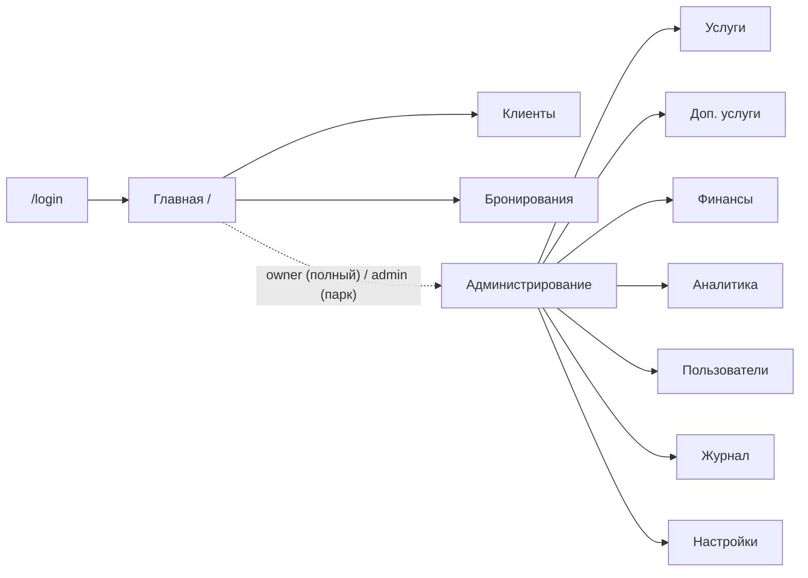

# PAGES — Белка Парк CRM (карта страниц «по-человечески»)

> Обзор каждой страницы CRM простым языком: что это, как работает по шагам и кто что может.
> Документ задуман как **рабочий чек-лист для решений «что менять»** — в каждом разделе есть пустой пункт «Что менять», в котором можно прямо здесь оставлять заметки.
>
> Технические подробности — в [REPORT.md](REPORT.md).
> Полная UX-спека и копирайтинг — в [DESIGN.md](DESIGN.md).
> Матрица доступа со стороны безопасности — в [SECURITY.md](SECURITY.md) §«Матрица доступа».

## 0. Кто есть кто (роли)

Основные роли в БД: **`owner`**, **`admin`**, **`instructor`**, **`cleaner`** ([config/permissions.js](../config/permissions.js), матрица [role_permissions](../config/database.js)). Роль **`manager`** снята: в БД при миграции переводится в **`admin`**.

| Роль в БД | Подпись в UI | Логин по умолчанию | Кратко |
| --- | --- | --- | --- |
| `owner` | **Владелец** | `owner / owner123` | полный набор прав; финансовые KPI на дашборде; обход матрицы в `requirePermission`; демо-панель |
| `admin` | **Администратор парка** | `admin / admin123` | операционная CRM (клиенты, брони, услуги, допы, смены, аналитика, `/quick`) **без** пользователей, журнала, настроек, матрицы доступов и модуля ЗП/финансов |
| `instructor` | **Инструктор (верёвочный курс)** | — | дашборд (сетка только `quests`), брони **только просмотр**, мой кабинет |
| `cleaner` | **Уборка** | — | дашборд (все колонки ресурсов), брони **только просмотр**, мой кабинет |

Старые роли (`operator`, `lasertag_instructor`, `quests_animator`) при сохранении пользователя приводятся к **`admin`** — см. [utils/roles.js](../utils/roles.js).

### Где живёт проверка прав

- **Глобально** в [server.js](../server.js) — `requireAuth` и **`requirePermission(...)`** / feature-флаги для разделов; **`requireRole('admin', 'owner')`** только у **`/admin/demo-preview`**. Проверки смотрят на **реальную** роль из сессии и не подменяются демо-режимом.
- **Внутри роутов** (детальные правила) — [routes/bookings.js](../routes/bookings.js) использует `canMutateBookings(role)` из [utils/rbac.js](../utils/rbac.js) для блокировки создания/редактирования/удаления.
- **В шапке/сайдбаре** ([views/partials/header.ejs](../views/partials/header.ejs)) видимость пунктов завязана на `effectiveRole` — это **роль с учётом демо-предпросмотра** (см. раздел 12 ниже).

### Сводная матрица доступа (быстрый взгляд)

Ниже — **дефолтная** матрица после сидинга. Детали можно менять в `/admin/access` (критический «замок» матрицы распространяется только на **`owner`**).

| Раздел | `owner` | `admin` (парк) | `instructor` / `cleaner` | Гейт в коде |
| --- | --- | --- | --- | --- |
| Вход / выход | да | да | да | публично |
| Главная | полные KPI + ₽ в календаре | операционные KPI, **без** чувствительных агрегатов и ₽ по дням | как у парка; сетка: инструктор — только `quests`, уборка — все колонки | `dashboard:view`, `canViewDashboardFinanceKPIs` ([utils/rbac.js](../utils/rbac.js)) |
| Клиенты | да | да | нет (нет `clients:*`) | `clients:view` / `clients:mutate` |
| Мой кабинет (`/me/*`) | да | да | да | `me:shifts` |
| Брони — список/карточка | да | да | да | `bookings:view` |
| Брони — создать/править | да | да | нет | `bookings:mutate`, `canMutateBookings` |
| Услуги / допы | да | да | нет | `services:manage`, `extras:manage` |
| `/quick/*` (модалки, «мои записи») | да | да | нет | `bookings:mutate` |
| Аналитика | да | да | нет | `admin:reports` |
| Финансы, ЗП, пользователи, журнал, настройки, матрица | да | **нет** | нет | `admin:salary`, `admin:users`, `admin:logs`, `admin:settings`, `admin:access` |
| Демо-предпросмотр | да | да | нет | `requireRole('admin', 'owner')` + `demo_mode_enabled` |

> У **`admin`** парка нет прав на системные разделы и финмодуль — при прямом URL будет 403. У линейного персонала мутации броней и `/quick` отключены — в шаблоне дашборда блок `#dashboard-quick` не рендерится.

---

## 1. Вход в систему (`/login`, выход)

**Что это:** страница входа и выход (`POST /logout`). Единственная страница, доступная без сессии.

**Как работает (по шагам):**
1. Пользователь открывает любой URL без сессии — Express через `requireAuth` редиректит на `/login`.
2. На `/login` форма с двумя полями: логин и пароль (см. [views/auth/login.ejs](../views/auth/login.ejs)).
3. На `POST /login` контроллер берёт SHA-256 от пароля и сравнивает с `users.password_hash` ([controllers/userController.js](../controllers/userController.js) → `validatePassword`). Если пользователь не найден, заблокирован (`is_active = 0`) или пароль не сошёлся — рендерится та же форма с сообщением «Неверный логин или пароль».
4. При успехе в сессию кладётся `{ id, username, role, name }` и идёт редирект на `/`.
5. `POST /logout` уничтожает сессию и редиректит обратно на `/login`.
6. В **dev-режиме** (`NODE_ENV !== 'production'`) на форме показана подсказка с тестовыми кредами; в продакшне блок скрыт.

**Доступ ролей:**
- Любая активная роль с валидными кредами; различия — после входа (матрица и гейты).
- Если пользователь уже авторизован и снова открывает `/login` — его сразу отправляет на `/`.

**Особое поведение / edge-cases:**
- Заблокированный пользователь (`is_active = 0`) получит то же сообщение «Неверный логин или пароль» — это сделано намеренно, чтобы не подсказывать факт существования логина.
- Сообщения об ошибке всегда одинаковые — без раскрытия причин.
- В проде обязательно требуется `SESSION_SECRET` ≥ 32 символов, иначе сервер не стартует ([server.js](../server.js)).

**Что менять:**
- [ ] _____

---

## 2. Главная / Дашборд (`/`)

**Что это:** стартовая страница после входа: KPI за день, календарь месяца и сетка занятости ресурсов по часам. Шаблон — [views/dashboard.ejs](../views/dashboard.ejs).

**Как работает (по шагам):**
1. Открывается `/` (или `/?date=YYYY-MM-DD`, `/?mode=day` / `/?mode=month`).
2. Контроллер ([routes/dashboard.js](../routes/dashboard.js)) собирает в одном запросе:
   - KPI: четыре карточки с финансовыми агрегатами («Всего клиентов», «Выручка за день» и суммы ₽ в календаре) — **только у `owner`**. У **`admin`**, **`instructor`**, **`cleaner`** — операционные карточки без этих агрегатов (`canViewDashboardFinanceKPIs`).
   - Сетку «ресурс × час» (часы берутся из настроек `work_start`/`work_end`) с цветовыми статусами `pending/confirmed/completed/cancelled`.
   - Календарь месяца с количеством броней по дням; суммы ₽ по дням показываются **только** руководителю (для менеджера в данных подставляется `revenue: 0`).
   - Режим дня (`mode=day`): таблица сетки на всех ширинах; на узких экранах — прокрутка вбок, закреплённая колонка времени.
3. Многочасовые брони показываются одной карточкой с `rowspan`; пустые ячейки помечаются «Свободно» и в режиме месяца кликабельны → редирект на форму брони с предзаполнением.
4. В шапке всегда доступна кнопка «Новая запись» (быстрая модалка). Глобальный поиск клиентов — у ролей с правом `clients:view` и включённым модулем клиентов (см. раздел 3).

**Доступ ролей:**
- **`owner` и `admin` (парк):** полная сетка по всем категориям ресурсов. Финансовые KPI и ₽ в календаре — **только у `owner`**.
- **`instructor`:** колонки сетки только категории **`quests`** (`allowedDashboardTypesForRole`).
- **`cleaner`:** все колонки (как у парка по охвату зон), без финансовых KPI.
- Кнопка «Новая запись» и блок «Мои записи за сегодня» — у ролей с **`bookings:mutate`** (по умолчанию `owner` и `admin` парка).

**Особое поведение / edge-cases:**
- Если в БД нет ресурсов — сетка пустая, KPI «Загрузка» = 0%.
- Бронь без позиций (`booking_items`) кладётся в первый свободный ресурс на её час.
- Бронь, уходящая после `work_end`, корректно ограничивается по `rowspan`, в карточке показывается фактическое окончание (например, 23:30).
- Часы сетки и знаменатель «Загрузки» берутся из настроек, а не зашиты в код — см. [utils/workHours.js](../utils/workHours.js).

**Что менять:**
- [ ] _____

---

## 3. Клиенты (`/clients`, `/clients/new`, `/clients/:id`, `/clients/:id/edit`)

**Что это:** клиентская база: поиск, карточки, история броней, бонусные баллы.

**Как работает (по шагам):**
1. **Список** `/clients` — таблица «ФИО / телефон / email / число броней / действия» с поиском по имени/телефону/email (LIKE).
2. **Карточка** `/clients/:id` — контакты, день рождения, заметки, поля по ребёнку, история броней (раскрывающиеся позиции), баланс бонусов и журнал бонусных операций (через [controllers/bonusController.js](../controllers/bonusController.js)).
3. **Создание** `GET /clients/new` → `POST /clients`. Обязательные: ФИО и телефон. Если форма открыта в режиме модалки/inline (например, из формы брони) — клиент возвращается JSON-ответом `201 { id }`.
4. **Редактирование** `GET /clients/:id/edit` → `PUT /clients/:id`.
5. **Удаление** `DELETE /clients/:id` — каскадно удаляет брони и позиции (`ON DELETE CASCADE`).
6. Глобальный поиск в шапке использует `GET /clients/search?q=...` и не перехватывается роутом `/:id` (исправлено в [BUG-001](bugs/BUG-001.md)).

**Доступ ролей:**
- **`owner`** и **`admin` (парк)** при дефолтной матрице: полный CRUD по клиентам. Гейты: [routes/clients.js](../routes/clients.js) + `canAccessClientList` / `canSearchClients` / `canEditClient` ([utils/rbac.js](../utils/rbac.js)); локаль формы — **`clientRecord`**, не `client`.
- **`instructor`** / **`cleaner`**: по умолчанию без `clients:*` — раздел недоступен.

**Особое поведение / edge-cases:**
- Дубликаты по телефону не запрещены — у пары может быть один номер.
- Нет confirm-диалога единого вида — браузерный `confirm()`.
- В модалке «Новый клиент» (из формы брони / шапки) тот же набор полей.
- В сайдбаре пункт «Клиенты» и глобальный поиск зависят от `canPreview('clients:view')` и feature-флагов.

**Что менять:**
- [ ] _____

---

## 4. Бронирования (`/bookings`, `/bookings/new`, `/bookings/:id`, `/bookings/:id/edit`)

**Что это:** ядро системы — создание, ведение и просмотр броней. Бронь содержит клиента, дату, длительность, **несколько позиций** (услуг и допов), статус и оплату.

**Как работает (по шагам):**
1. **Список** `GET /bookings` — таблица предстоящих/прошлых броней. Фильтры: категория (чипы Беседки / Квесты / Доп. товары / Все), статус, диапазон дат, поиск по клиенту. Логика фильтров — [utils/bookingListFilters.js](../utils/bookingListFilters.js).
2. **Создание** `GET /bookings/new`:
   - Выбор клиента (с подгрузкой бонусов через `GET /bookings/api/bonus/:clientId`) либо создание нового клиента inline.
   - Добавление **одной или нескольких позиций**: услуги (беседка/квест) и допы. У каждой позиции своё время, длительность, кол-во.
   - Тариф: «за час» / «фикс» / «за человека» (определяется услугой; цена редактируется только у допов).
   - Промо «N+1»: при сумме часов ≥ порога автоматически считается скидка ([routes/bookings.js](../routes/bookings.js) → `/api/promo`).
   - Списание бонусов (если есть баланс).
   - Статус (`pending/confirmed/completed/cancelled`) и оплата (`unpaid/partial/paid`); при `partial` — поле «Сумма предоплаты» (автоподстановка: ровно `min(1000 ₽, итог)`; сервер отклоняет любую другую сумму).
3. На `POST /bookings` сервер валидирует входные данные и проверяет конфликты по времени:
   - Беседки — конфликт по `service_id`.
   - Квест — конфликт по **категории** `quests` (общий пул).
   - При конфликте: 409 «Время пересекается с бронированием #N: ...».
4. **Карточка** `GET /bookings/:id` — все позиции, итог, оплата, кнопки «Редактировать», «Удалить», «Сменить статус».
5. **Редактирование** `GET /bookings/:id/edit` → `PUT /bookings/:id`. Конфликты проверяются и при обновлении (исключая текущую бронь).
6. **Смена статуса** `PATCH /bookings/:id/status` — отдельная мутация.

**Доступ ролей:**
- **`owner`** и **`admin` (парк):** полные мутации броней при наличии `bookings:mutate` (`canMutateBookings` в [utils/rbac.js](../utils/rbac.js)).
- **`instructor`** / **`cleaner`:** просмотр списка и карточек (`bookings:view`), **без** создания/правок — 403 на мутации.

**Особое поведение / edge-cases:**
- При «Частично» итог делится на «Предоплата» и «К доплате» (`prepayment_amount`); сумма предоплаты фиксируется правилами (`utils/prepaymentRules.js` + режим услуги в каталоге).
- Редактирование длинной формы корректно восстанавливает выбранные позиции (есть защитная сериализация JSON в EJS — `<` → `\u003c`).
- Удаление брони каскадно убирает её позиции (`booking_items` через CASCADE).
- API: `GET /bookings/api/services-by-client`, `GET /bookings/api/items/:id`, `GET /bookings/api/bonus/:clientId`, `GET /bookings/api/promo`, `GET /bookings/api/catalog` (последний — только для ролей с `canMutateBookings`).

**Что менять:**
- [ ] _____

---

## 5. Услуги (`/services`, право `services:manage`)

**Что это:** каталог ресурсов — беседки (7 шт. в сиде), квесты. Без услуг бронирование невозможно.

**Как работает (по шагам):**
1. **Список** `GET /services` — две группы (Беседки / Квесты), таблицы по группам.
2. **Создание** `GET /services/new` → `POST /services`. Поля: название (обязательно), категория (обязательно: `gazebos` / `quests`), описание, вместимость, цена за час / фиксированная / за человека (любая комбинация — приоритет в UI), для **беседок** — пояснение предоплаты при «Частично» (1000 ₽ до итога), флаг «Активна».
3. **Редактирование** `GET /services/:id/edit` → `PUT /services/:id`.
4. **Toggle активности** `POST /services/:id/toggle` — выключает услугу, сохраняя историю в существующих бронях.
5. **Удаление** `DELETE /services/:id` — может упасть, если есть зависимые брони (контролируется БД).

**Доступ ролей:**
- **`owner`** и **`admin` (парк)** при дефолтной матрице: полный CRUD. Гейт — `requirePermission('services:manage')` в [server.js](../server.js).
- Линейный персонал и прочие без права — **403**.

**Особое поведение / edge-cases:**
- Неактивная услуга (`is_active = 0`) не показывается в форме брони, но не ломает уже созданные брони.
- Цена услуг в форме брони у админа — readonly (только в каталоге услуг).

**Что менять:**
- [ ] _____

---

## 6. Доп. услуги (`/extras`, право `extras:manage`)

**Что это:** простой справочник «допов» — мангал, уголь, проектор, аренда оборудования и т. п.

**Как работает (по шагам):**
1. **Список** `GET /extras` — таблица «название / цена / единица» (`шт`/`компл`).
2. CRUD сделан inline (без отдельных экранов): `POST /extras`, `PUT /extras/:id`, `DELETE /extras/:id` через формы списка.
3. Допы доступны как позиции в форме брони (с количеством и ценой за единицу).

**Доступ ролей:**
- **`owner`** и **`admin` (парк)** при дефолтной матрице: полный CRUD (`requirePermission('extras:manage')`).
- Остальные без права — **403**.

**Особое поведение / edge-cases:**
- В отличие от услуг, цена допа в форме брони редактируется (по позиции).
- Нет toggle активности — управление только через удаление/добавление.

**Что менять:**
- [ ] _____

---

## 7. Финансы (`/admin/finance/*`, право `admin:salary`)

**Что это:** финансовый модуль владельца: касса, оплаты по броням, расходы, смены сотрудников, выплаты. Кассовый метод + упрощённый P&L.

**Как работает (по шагам):**
1. **Сводка** `GET /admin/finance` — за период (по умолчанию 30 дней): «Поступления» (`booking_payments`), «Расходы» (`expenses`), «Выплаты» (`payouts`), «Прибыль» = поступления − расходы − выплаты, «К доплате (дебиторка)» по броням периода; блок **оценочных** показателей: начисления по сменам за период. Подстраницы связаны общей навигацией (Сводка / Оплаты / …).
2. **Оплаты по броням** `GET /admin/finance/payments` — список броней с колонками «Сумма / Оплачено / К доплате». Карточка `GET /admin/finance/payments/:bookingId` — все платежи по брони + форма добавления операции (оплата/возврат, способ, сумма, дата, комментарий); кнопка «К списку оплат» и та же поднавигация, что на остальных экранах финансов. Добавление платежа автоматически синхронизирует `bookings.payment_status` и `bookings.prepayment_amount`.
3. **Расходы** `GET /admin/finance/expenses` — журнал, фильтры по категории/способу, добавление через `POST /admin/finance/expenses`, удаление `POST /admin/finance/expenses/:id/delete`.
4. **Смены** `GET /admin/finance/shifts` — начисления по сменам (почасовая/фикс), привязаны к пользователю.
5. **Выплаты** `GET /admin/finance/payouts` — фактические выплаты сотрудникам.
6. **Экспорт CSV** `GET /admin/finance/export?type=overview|payments|expenses|payouts&start_date=…&end_date=…` (UTF-8 BOM, разделитель `;`); для `overview` дополнительно колонки KPI броней и начислений по сменам.

**Доступ ролей:**
- **`owner`** при дефолтной матрице: полный доступ. Гейт — `requirePermission('admin:salary')` в [server.js](../server.js).
- **`admin` (парк)** и линейный персонал: **403** на `/admin/finance/*`. Операционный учёт через `/quick` — у ролей с `bookings:mutate` (раздел 7a).

**Особое поведение / edge-cases:**
- При добавлении платежа сумма не должна делать `paid > total_price` (иначе ошибка валидации в `financeController`).
- В сводке учитываются **только активные** статусы броней (отменённые исключаются из дебиторки).
- Удалить пользователя, на которого есть смены/выплаты, нельзя — каскад/ошибка зависит от схемы; см. [scripts/postgres/init.sql](../scripts/postgres/init.sql).
- Расходы и смены из `/quick/*` попадают в `expenses` / `staff_shifts` и видны в финмодуле пользователю с `admin:salary`. Для смен модалка ставит `rate_type='hourly'`, `rate_value=0` — ставку при сверке проставляет владелец (или кто имеет доступ к финансам).

**Что менять:**
- [ ] _____

---

## 7a. Быстрые действия: «Расход» и «Смена» (`/quick/*`)

**Что это:** две лёгкие модалки в шапке (рядом с «Новая запись») и блок «Мои записи за сегодня» на дашборде. Назначение — дать администратору зала способ оперативно фиксировать расход и смену прямо из основного потока работы, не открывая полноценный финансовый модуль.

**Что добавлено:**
- В шапке кнопки **«Расход»** и **«Смена»** — при праве **`bookings:mutate`** (по умолчанию `owner` и `admin` парка).
- Блок «Мои записи за сегодня» на дашборде рендерится только при **`bookings:mutate`** (нет лишних запросов к `/quick` у линейного персонала).

**Как работает (по шагам):**
1. **Расход** (`#quick-expense-modal`) — поля: «Сумма (₽)», «Категория» (radio: `salary` / `purchase` / `other` / `prepayment_refund` / `custom` со свободной строкой `vendor`), «Способ оплаты» (`cash` по умолчанию), «Заметка». Сохранение → `POST /quick/expenses`. Запись падает в таблицу `expenses` с `created_by = current_user.id`.
2. **Смена** (`#quick-shift-modal`) — поля: «Сотрудник» (загрузка из `GET /quick/users`), «Дата» (по умолчанию сегодня), «Время с» / «до» (HH:MM, шаг 15 мин), «Заметка». Сохранение → `POST /quick/shifts`. На сервере вычисляется `hours = (end − start) / 60`, запись пишется в `staff_shifts` (новые поля `start_time`, `end_time`, `created_by`); `rate_type='hourly'`, `rate_value=0` (ставку позже проставляет тот, кто ведёт финансы/ЗП).
3. **Мои записи за сегодня** — на дашборде есть `dashboard-quick`. JS подгружает `GET /quick/today` и рисует две таблички. Расходы фильтруются по `created_by = текущий пользователь`, смены — по `user_id = текущий пользователь` ИЛИ `created_by = текущий пользователь`.
4. **Удаление своей свежей записи** — кнопка «Удалить» рядом с записью появляется, только если запись младше **1 часа**. Нажатие → `DELETE /quick/expenses/:id` или `DELETE /quick/shifts/:id`. Окно «1 час» задано константой `QUICK_DELETE_WINDOW_MS` в [utils/rbac.js](../utils/rbac.js).

**Доступ ролей:**
- **`owner`:** создаёт записи; удаляет **любые** (без окна 1 час).
- **`admin` (парк):** создаёт записи; удаляет **только свои** в течение **1 часа** — иначе `403` (`canDeleteOwnQuickRecord`).

**Гейты в коде:**
- Все эндпоинты живут в [routes/quick.js](../routes/quick.js) и подключены в [server.js](../server.js) под `requireAuth` (без `requireRole('admin')`).
- Удаление проверяется хелпером `canDeleteOwnQuickRecord(creatorId, currentUserId, createdAt, role)` из [utils/rbac.js](../utils/rbac.js).
- Логирование действий идёт через `logAction('expense' | 'shift')` из [middleware/logger.js](../middleware/logger.js) — поля `password*` обрезаются санитайзером, тут их и нет.

**Особое поведение / edge-cases:**
- Время смены **через полночь** не поддерживается: если `end ≤ start` — `400`.
- Категория `custom` обязательно требует поле `vendor` (свободная строка); сохраняется в `expenses.vendor`.
- Пользователь с доступом к `/quick` может записать смену **на любого сотрудника** из списка. Ограничить «только на себя» — правка в роутере.
- В блоке «Мои записи за сегодня» показываются смены, где пользователь указан как `user_id` или как `created_by`.
- БД-миграция: при первом запуске на существующей БД в `staff_shifts` появляются колонки `start_time`, `end_time`, `created_by` (см. [config/database.js](../config/database.js) и [scripts/postgres/migrate.sql](../scripts/postgres/migrate.sql)).

**Что менять:**
- [ ] _____

---

## 8. Аналитика и отчёты (`/admin/reports`, право `admin:reports`)

**Что это:** дашборд аналитики с графиками (Chart.js) и CSV-экспортом данных.

**Как работает (по шагам):**
1. **Главная страница отчёта** `GET /admin/reports`. Фильтры:
   - Период: пресеты 7 / 30 / 90 / 365 дней или **«Свой диапазон»** (`period=custom` + `start_date`/`end_date`).
   - Категории (мульти-чекбокс): `gazebos`, `quests`, `extra` (в API для старых данных допустим `lasertag`).
2. KPI-карточки: всего броней, выручка, завершённые/отменённые, средний чек, всего клиентов.
3. Графики:
   - Выручка и брони по дням (комбо-столбцы + линия).
   - Доход по категориям (кольцо/бар).
   - Сравнение по месяцам (12 месяцев).
   - Распределение статусов и оплат (кольца).
   - Популярность часа начала (24 столбца).
   - Топ-10 услуг и Топ-10 клиентов (таблицы).
4. **Живой пересбор** без перезагрузки — `GET /admin/reports/api/data` (JSON).
5. **Экспорт CSV** `GET /admin/reports/export?type=bookings|clients|finance&start_date=…&end_date=…` (UTF-8 BOM, `;`).

**Доступ ролей:**
- **`owner`** и **`admin` (парк)** при дефолтной матрице: полный доступ (`requirePermission('admin:reports')` + feature).
- Линейный персонал без права — **403**.

**Особое поведение / edge-cases:**
- Пресеты 7/30/90 считаются **в локальной календарной шкале** до сегодняшней даты — это синхронизирует график «по дням» и KPI overview.
- Категории в `req.query.categories` могут прийти массивом (несколько чекбоксов) — обрабатывается `categoriesFromQuery()` в [routes/admin-reports.js](../routes/admin-reports.js).
- Если БД пустая в выбранном периоде — KPI = 0, графики пустые без падений.

**Что менять:**
- [ ] _____

---

## 9. Пользователи (`/admin/users`, право `admin:users`)

**Что это:** управление учётными записями: создание/редактирование, смена роли, блокировка.

**Как работает (по шагам):**
1. **Список** `GET /admin/users` — таблица + 4 KPI (всего, активных, руководителей, администраторов). Поиск по логину/имени.
2. **Создание** `GET /admin/users/new` → `POST /admin/users`. Поля: логин (обяз.), пароль (мин. 4 символа), ФИО (обяз.), роль (`owner` / `admin` / `instructor` / `cleaner`), дата рождения, опц. поля ребёнка. Дубликат логина → ошибка «Пользователь с таким именем уже существует».
3. **Редактирование** `GET /admin/users/:id/edit` → `PUT /admin/users/:id`. Пустой пароль = «не менять». Можно отключить (`is_active`) — тогда вход будет блокироваться без раскрытия причины.
4. **Удаление** `DELETE /admin/users/:id` (через JS на странице). Удалить пользователя `username='admin'` нельзя — сервер вернёт «Нельзя удалить главного руководителя (логин admin)».
5. Все мутации логируются в `activity_logs` (`logAction('user')` в [middleware/logger.js](../middleware/logger.js)) — но из `details` вырезаются чувствительные поля (см. SEC-07).

**Доступ ролей:**
- **`owner`** при дефолтной матрице: всё.
- **`admin` (парк)** и остальные без `admin:users`: **403**.

**Особое поведение / edge-cases:**
- Старые роли (`operator`, `lasertag_instructor`, `quests_animator`) при сохранении нормализуются к **`admin`** (`sanitizeUserRole` в [utils/roles.js](../utils/roles.js)).
- Пароли хранятся как SHA-256 без соли — задача в бэклоге безопасности (SEC-02).

**Что менять:**
- [ ] _____

---

## 10. Журнал действий (`/admin/logs`, право `admin:logs`)

**Что это:** аудит мутаций (создание/обновление/удаление сущностей) с фильтрами и пагинацией.

**Как работает (по шагам):**
1. **Список** `GET /admin/logs?page=N` — таблица записей `activity_logs` (50 на страницу). Фильтры: действие, тип сущности, пользователь, диапазон дат.
2. Записи пишет `logAction(entityType)` ([middleware/logger.js](../middleware/logger.js)) — крепится к роутам пользователей, настроек и др. Сохраняет: метод, путь, действие (`create/update/delete`), тип сущности, id сущности, id пользователя, фрагмент `req.body` (с маскированием паролей и токенов), время.
3. **Очистка старых записей** `POST /admin/logs/clear` — форма «дней» (по умолчанию 90), удаляет более старые записи. Сообщение «Журнал очищен».

**Доступ ролей:**
- **`owner`** при дефолтной матрице: всё.
- **`admin` (парк)** без права — **403**.

**Особое поведение / edge-cases:**
- Колонка `details` хранит ограниченный фрагмент `req.body`; после фикса BUG-004/SEC-07 пароли больше не попадают, но история до фикса может содержать старые данные.
- На PostgreSQL `created_at` — тип `Date`; форматирование делает `app.locals.formatDateTimeRu` в [server.js](../server.js).

**Что менять:**
- [ ] _____

---

## 11. Настройки (`/admin/settings`, право `admin:settings`)

**Что это:** глобальные параметры парка (название, рабочие часы, политики бронирования, бонусы, акции, демо-режим, форматы).

**Как работает (по шагам):**
1. **Открытие** `GET /admin/settings` — все настройки сгруппированы по секциям:
   - Основные: `park_name`.
   - Рабочее время: `work_start`, `work_end`.
   - Бронирования: `time_slot_minutes`, `booking_max_days`, `booking_cancel_hours`.
   - Бонусная система: `bonus_enabled`, `bonus_percent`, `bonus_rate`.
   - Акция: «час в подарок» — `promo_enabled`, `promo_hours_threshold`, `promo_free_hours`.
   - Демо-режим: `demo_mode_enabled` (см. раздел 12).
   - Форматирование: `currency`, `phone_format`.
2. **Сохранение** `POST /admin/settings` — обновляет все поля, успешный редирект `?success=saved` → «Настройки сохранены». Запись в журнал через `logAction('settings')`.

**Доступ ролей:**
- **`owner`** при дефолтной матрице: всё.
- **`admin` (парк)** без права — **403**.

**Особое поведение / edge-cases:**
- Изменение `work_start`/`work_end` сразу влияет на сетку дашборда и знаменатель «Загрузки» — не нужно перезапускать сервер.
- Выключение `demo_mode_enabled` сбрасывает сохранённую `session.demoPreviewRole` у владельца/админа парка (см. раздел 12).
- Чекбоксы (`bonus_enabled`, `promo_enabled`, `demo_mode_enabled`) сохраняются как `'1'`/`'0'`.

**Что менять:**
- [ ] _____

---

## 12. Демо-режим предпросмотра ролей (`POST /admin/demo-preview`)

**Что это:** возможность **владельцу или администратору парка** посмотреть интерфейс **глазами другой роли** (инструктор, уборка и т.д.) без смены учётки. Удобно для демо/обучения.

**Как работает (по шагам):**
1. Пользователь с ролью **`admin`** или **`owner`** включает в `/admin/settings` чекбокс **«Демо-режим: предпросмотр ролей»** (`demo_mode_enabled = 1`).
2. После этого в шапке появляется **панель «Предпросмотр как»** ([views/partials/demo-role-panel.ejs](../views/partials/demo-role-panel.ejs)) с выбором ролей предпросмотра.
3. Выбор отправляется `POST /admin/demo-preview` ([routes/admin-demo-preview.js](../routes/admin-demo-preview.js)) и кладётся в `session.demoPreviewRole`.
4. Middleware в [server.js](../server.js) считает `effectiveRole` ([utils/demoPreview.js](../utils/demoPreview.js) → `resolveEffectiveRole`):
   - если демо выключен или реальная роль не `admin` и не `owner` → `effectiveRole = реальная роль`;
   - если включён и выбрана роль предпросмотра → `effectiveRole = выбранная`.
5. **На что влияет `effectiveRole`:** видимость пунктов сайдбара (блок «Администрирование» сужается в режиме «как Администратор»), бейдж роли в шапке, фильтры дашборда и брони (через `effectiveRoleFromRequest`).
6. **На что НЕ влияет:** серверные гейты **`requirePermission`** и матрица — они используют **реальную** роль из сессии. Если у учётки есть право `admin:users`, страница `/admin/users` откроется даже при предпросмотре «как instructor» (реальные права не понижаются).

**Доступ ролей:**
- **`owner`** и **`admin` (парк):** при включённом демо видят панель и могут вызывать `POST /admin/demo-preview` (`requireRole('admin', 'owner')`).
- Линейный персонал: панели нет; `POST /admin/demo-preview` = **403**.

**Особое поведение / edge-cases:**
- Выключение демо-режима в настройках сбрасывает `session.demoPreviewRole` у всех на следующем запросе.
- Бейдж в шапке «Демо: Администратор» подсвечивает, что текущий просмотр идёт под чужой ролью.
- Это **не security-фича**, а UX-инструмент. Описание уровня «карта vs реальный пропуск» — в [SECURITY.md](SECURITY.md), раздел «Матрица доступа».

**Что менять:**
- [ ] _____

---

## Приложение A. Где какие гейты прописаны (для разработчика)

| URL | Middleware | Файл |
| --- | --- | --- |
| `/login`, `/logout` | публично | [routes/auth.js](../routes/auth.js) |
| `/` | `requireAuth` | [server.js](../server.js), [routes/dashboard.js](../routes/dashboard.js) |
| `/clients/*` | `requireAuth` | [server.js](../server.js), [routes/clients.js](../routes/clients.js) |
| `/bookings`, `/bookings/:id` | `requireAuth` | [server.js](../server.js), [routes/bookings.js](../routes/bookings.js) |
| `/bookings/new`, `POST /bookings`, `PUT/PATCH/DELETE /bookings/:id*` | `requireAuth` + `canMutateBookings` (внутри роута) | [routes/bookings.js](../routes/bookings.js), [utils/rbac.js](../utils/rbac.js) |
| `/services/*` | `requireAuth` + `requirePermission('services:manage')` (+ feature) | [server.js](../server.js) |
| `/extras/*` | `requireAuth` + `requirePermission('extras:manage')` (+ feature) | [server.js](../server.js) |
| `/admin/finance/*` | `requireAuth` + `requirePermission('admin:salary')` (+ feature) | [server.js](../server.js) |
| `/admin/reports/*` | `requireAuth` + `requirePermission('admin:reports')` (+ feature) | [server.js](../server.js) |
| `/admin/users/*` | `requireAuth` + `requirePermission('admin:users')` | [server.js](../server.js) |
| `/admin/logs/*` | `requireAuth` + `requirePermission('admin:logs')` | [server.js](../server.js) |
| `/admin/settings/*` | `requireAuth` + `requirePermission('admin:settings')` | [server.js](../server.js) |
| `POST /admin/demo-preview` | `requireAuth` + `requireRole('admin', 'owner')` + `demo_mode_enabled` | [routes/admin-demo-preview.js](../routes/admin-demo-preview.js) |
| `/quick/*` | `requireAuth` + `requirePermission('bookings:mutate')` | [server.js](../server.js) |

## Приложение B. Как пользоваться этим документом

1. Прочитать раздел нужной страницы.
2. В пункте «Что менять» поставить пункт `- [ ] описание правки` (или несколько).
3. После согласования — Dev переносит пункты в `coordination/` как TASK-файлы и реализует через `/implement` или `/orchestrate` (см. правила репо).
4. После каждой правки — `npm test` и запись в [coordination/HANDOFF.md](../coordination/HANDOFF.md).
