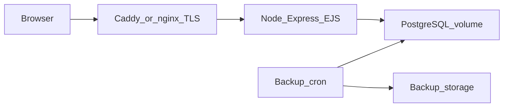

# Проектирование Белка Парк CRM под VPS

Документ фиксирует вопросы к заказчику/эксплуатации, **зафиксированные ответы** (§1), выводы для приоритетов (§2), **утверждённую** целевую архитектуру и базовую спецификацию эксплуатации на удалённом VPS в РФ. Технический инвентарь приложения — в [REPORT.md](REPORT.md), UX — в [DESIGN.md](DESIGN.md).

---

## 1. Вопросы и зафиксированные ответы

*Дата фиксации ответов: 2026-05-04.*

| № | Вопрос | Ответ |
|---|--------|-------|
| 1 | **Пиковая нагрузка:** сколько человек *одновременно* в CRM в самый загруженный день (касса + админ + операторы)? Порядок: до 5, 5–15, 15–50? | **До 5** |
| 2 | **Сценарий доступа:** только офис/ПК по проводу или обязательно стабильная работа с телефона в поле (слабый LTE, переключение сетей)? | **И с телефона, и с ПК** |
| 3 | **Интеграции:** в горизонте 6–12 месяцев нужны 1С, онлайн-касса/ОФД, эквайринг, SMS/Telegram клиенту, внешняя аналитика, экспорт по API? | **Возможно да**, к интеграциям будут обращаться |
| 4 | **Персональные данные:** требуется ли явное оформление по 152-ФЗ (политика, согласия, локализация на РФ) или внутренняя CRM без формального контура? | **Внутренняя CRM** (без отдельного контура под 152-ФЗ) |
| 5 | **Доступ извне:** только внутренняя сеть/VPN или публичный интернет по домену? Нужен whitelist IP? | **Публичный доступ по домену**, развёртывание на VPS |
| 6 | **Простой при обслуживании:** допустима ночная остановка 2–5 минут при деплое/миграциях или нужен zero-downtime? | **Допустима** ночная остановка 2–5 минут |
| 7 | **Сопровождение:** кто обновляет ОС, смотрит логи, восстанавливает из бэкапа — вы, подрядчик, штатный IT? | **Самостоятельно** |
| 8 | **Бюджет инфраструктуры:** ориентир руб/мес на VPS + бэкапы + мониторинг (до 1k / 1–3k / 3k+)? | **1–3 тыс. ₽/мес** |
| 9 | **Масштаб данных:** ожидаемый объём бронирований в год; хранить все годы в одной системе или архивировать сезоны? | **Архивировать старые сезоны**; оценка **до 500–900 бронирований в год** |
| 10 | **Эволюция продукта:** планируется публичный сайт бронирования для гостей или мобильное приложение сотрудников, или только внутренняя веб-CRM? | **Только внутренняя веб-CRM** |

---

## 2. Выводы для архитектуры и приоритетов

Исходя из ответов выше:

- **Нагрузка и VPS:** пик **до 5** одновременных пользователей и **500–900** броней в год — текущая схема «один VPS, 2 GB RAM, 1 vCPU, SSD» остаётся с запасом; managed-кластер не требуется.
- **Мобильный доступ:** приоритет **адаптивной вёрстки и UX на телефоне** (см. бэклог в [DESIGN.md](DESIGN.md) §13); тестировать на слабом LTE; не планировать отдельное нативное приложение.
- **Публичный домен:** обязательны **HTTPS**, усиление входа (rate limit, сильные пароли, убрать подсказки демо-логинов в проде — [SECURITY.md](SECURITY.md)), базовый мониторинг доступности.
- **Интеграции «возможно»:** при реализации первой интеграции закладывать **исходящие вебхуки / фоновые задачи / секреты в env**, не смешивать с синхронным UI; при необходимости очередь (например Redis + worker) — отдельным этапом.
- **152-ФЗ:** без формального контура — всё равно разумный минимум: не светить ПИ в логах, бэкапы, доступ по паролю/ролям (см. SECURITY).
- **Архив сезонов:** в продуктовом бэклоге — явный сценарий (например, экспорт года + пометка «архив» / отдельное хранилище), чтобы БД и отчёты оставались быстрыми; объём данных мал, но политика «не держим вечно всё в активной CRM» зафиксирована.
- **Сопровождение силами одного человека:** проще **Docker Compose + один runbook** на деплой/бэкап/восстановление, без лишней распределённости.

---

## 3. Утверждённая целевая архитектура (решение по умолчанию)

Ответы из §1 **не меняют** базовую целевую схему ниже; они уточняют приоритеты (см. §2). Считаем **утверждённым** следующее:

- **Стек приложения:** не переписывать; оставить **Node.js + Express + EJS** (см. [REPORT.md](REPORT.md) §2).
- **База данных (цель продакшена):** **PostgreSQL** вместо текущего **sql.js** (SQLite в WASM + файл). Причины: транзакции, конкурентная запись, `pg_dump`, предсказуемые бэкапы и восстановление.
- **Топология:** один VPS в РФ (SSD), **Docker Compose**: контейнер приложения + контейнер PostgreSQL + именованные volumes для данных БД.
- **Граница:** TLS и HTTP(S) на **обратном прокси** (Caddy или nginx) на хосте или отдельным контейнером; приложение слушает внутреннюю сеть (порт 3000).
- **Секреты:** `SESSION_SECRET`, пароль PostgreSQL и прочее — только переменные окружения / secret manager, не в git.

### 3.1 Текущее состояние кода vs инфраструктура

- **Сейчас в репозитории:** приложение использует **sql.js** и файл `data/forest-park.db` (см. [config/database.js](../config/database.js)).
- **В Docker Compose добавлен** сервис **PostgreSQL** и скрипт инициализации схемы [scripts/postgres/init.sql](../scripts/postgres/init.sql) — это **целевая** схема для будущего подключения приложения.
- **Следующий этап разработки (не входит в этот документ как выполненный код):** заменить слой доступа к данным на драйвер `pg` (async), переписать запросы с учётом диалекта PostgreSQL (`RETURNING id` вместо `last_insert_rowid`, `to_char`/`date_trunc` вместо `strftime`/`date('now', …)` и т.д.), прокинуть `DATABASE_URL` в контейнер приложения.

---

## 4. Спецификация VPS и эксплуатации (baseline)

### 4.1 Размер VPS (старт)

| Ресурс | Рекомендация | Комментарий |
|--------|--------------|-------------|
| RAM | **от 2 GB** | Node + ОС + PostgreSQL + прокси; 1 GB возможен, но тесно под пик. |
| vCPU | **1** (старт), **2** при росте нагрузки | Для десятков одновременных сессий CRM обычно достаточно 1 vCPU. |
| Диск | **SSD**, от **20 GB** | Объём растёт с логами и БД; заложить запас под бэкапы на том же диске или вынести бэкапы. |
| Локация | ДЦ **в РФ**, ближе к пользователям CRM | Задержка и предсказуемость канала. |

По зафиксированным ответам (пик **до 5**, до **~900** броней/год): конфигурация из таблицы достаточна. Если позже пик вырастет **15–50** или отчёты станут «тяжёлыми» — увеличить RAM/vCPU и рассмотреть отдельный managed-Postgres.

### 4.2 TLS и доступ

- Домен → A-запись на публичный IP VPS.
- **Let's Encrypt** (или сертификат провайдера) на nginx/Caddy; редирект HTTP → HTTPS.
- SSH: по ключу, по возможности отключить парольный вход; **UFW** или аналог: открыть **22, 80, 443** (22 ограничить по IP при возможности).
- По ответу на п.5: при публичном доступе — rate limit на `/login`, сильные пароли, убрать подсказки демо-логинов в проде (см. [DESIGN.md](DESIGN.md), [SECURITY.md](SECURITY.md)).

### 4.3 Бэкапы

- **Ежедневно:** `pg_dump` (custom или plain) в каталог на диске или во внешнее object storage.
- **Ротация:** например 7 дневных + 4 недельных снимка (подстроить под политику парка).
- **Проверка:** не реже чем раз в квартал — тестовое восстановление на отдельной машине/VM.
- Для переходного периода на sql.js: копирование файла `forest-park.db` по расписанию, пока приложение не переведено на Postgres.

### 4.4 Мониторинг и логи

- Минимум: проверка **доступности HTTP(S)** (внешний или self-hosted uptime), алерт при падении диска/памяти (встроенные средства хостинга или лёгкий стек).
- Логи приложения: stdout контейнера + ротация на хосте или драйвер логов провайдера.

### 4.5 Деплой и простой

- По умолчанию (ответ п.6 не «zero-downtime»): **допустим короткий простой** 2–5 минут в ночное окно: `docker compose pull && build && up`, миграции БД до/после старта по runbook.
- Zero-downtime на одном VPS без оркестратора — усложнение; имеет смысл только после явного требования.

### 4.6 Целевая схема (mermaid)

---

## 5. Когда целевой вариант нужно пересмотреть

- Пик **>15** одновременных пользователей с тяжёлыми отчётами (сейчас зафиксировано «до 5» — запас большой).
- Требование **нескольких инстансов** приложения за балансировщиком → общие сессии (Redis или sticky sessions) и managed PostgreSQL.
- Реализация **интеграций** (1С, ОФД, эквайринг, SMS/Telegram и т.д. — в ответах «возможно да»): при появлении первой боевой интеграции — очереди, воркеры, секреты, при необходимости второй VPS или managed-сервисы.

---

## 6. Связанные файлы в репозитории

| Файл | Назначение |
|------|------------|
| [docker-compose.yml](../docker-compose.yml) | Сервис приложения + PostgreSQL + volumes |
| [scripts/postgres/init.sql](../scripts/postgres/init.sql) | DDL и начальные данные под PostgreSQL (аналог первого запуска sql.js) |
| [.env.example](../.env.example) | Шаблон переменных для продакшена (без секретов в git) |
| [docs/RUNBOOK.md](RUNBOOK.md) | Деплой, TLS, бэкапы, откат |
| [docs/POSTGRES_MIGRATION.md](POSTGRES_MIGRATION.md) | Чеклист перевода приложения на `pg` |
| [docs/PRODUCT_ROADMAP.md](PRODUCT_ROADMAP.md) | Мобильный UX, архив сезонов, интеграции |
